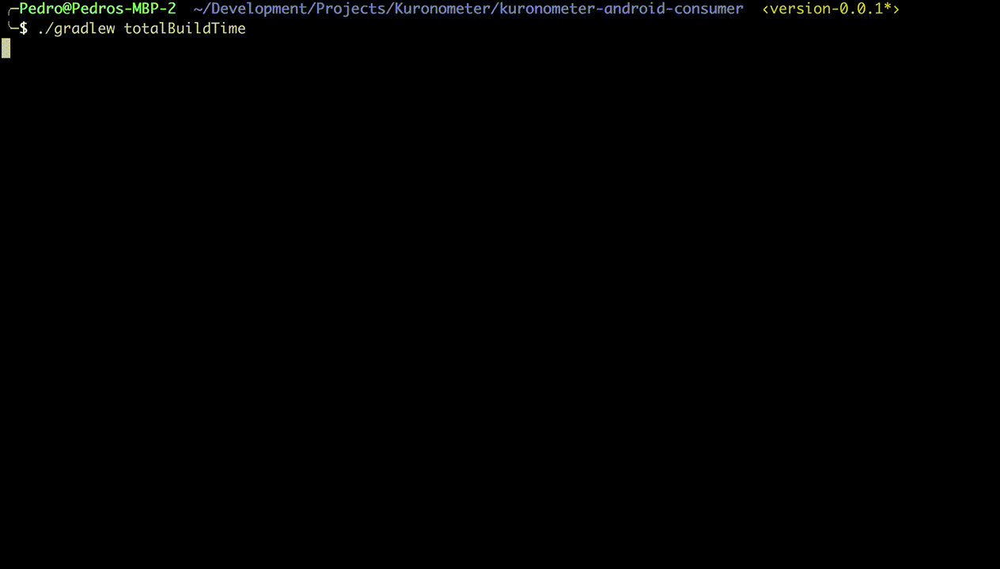

Kuronometer [](https://travis-ci.org/pedrovgs/Kuronometer)
===========

Kuronometer is a [Gradle Plugin](https://docs.gradle.org/current/userguide/custom_plugins.html) developed using purely functional programming in [Scala](https://www.scala-lang.org/). Using this Gradle plugin you can see how long you've been compiling your project during the last day or since the last clean execution using just one command:

**After configuring this plugin execute any build from Android Studio or your terminal:**

```
./gradlew assemble
```

Then check the build time gathered using the following commands:

```
./gradlew totalBuildTime
```

or

```
./gradlew todayBuildTime
```



Additionally, Kuronometer is going to report your build time to a remote service we will use to show how long developers around the world have been building software. Soon, we will publish a real time chronometer with the amount of time we've been building software [here](http://kuronometer.io). Your project data can be reported anonymously, so don't be afraid of using this project. Server side code can be found [here](https://github.com/delr3ves/KuronometerServer).


## Installation

Apply the plugin in your ``build.gradle``:

```groovy

buildscript {
  repositories {
    mavenCentral()
  }
  dependencies {
    classpath 'com.github.pedrovgs:kuronometer:0.0.5'
  }
}

apply plugin: 'com.github.pedrovgs.kuronometer'

```

## Configuration

You just need to indicate the project platform being used:

```groovy
...
apply plugin: 'com.github.pedrovgs.kuronometer'

kuronometer {
    platformName = 'Android' //This value can be Android, Java or Scala
}
```

If you need any advanced configuration:

```groovy

kuronometer {
    //Config used to indicate the platform name. By default the value configured is Java.
    //This value can be 'Android', 'Java' or 'Scala' for now.
    platformName = 'Android'
    //Config used to attach or not sensitive information before to being reported. By default is true.
    //This value can be true or false.
    reportProjectInfo = true
    //Config used to send or not the build report to the kuronometer server. By default is true.
    //This value can be true or false.
    reportDataRemotely = true
    //Config used to show a message after the build execution showing the report execution result. By default is false.
    //This value can be true or false.
    verbose = true
}
```

Inside the [kuronometer-consumer](./kuronometer-consumer/build.gradle) and the [kuronometer-android-consumer](./kuronometer-android-consumer/app/build.gradle) folders you can find two configuration examples.

## Build and test this project

To build this and runt the unit and integration tests execute ``./gradlew build``.

## Run this project

To install this plugin in a local repository and test it from any consumer execute these commands:

```
./gradlew install
cd kuronometer-consumer
./gradlew build
```

## Release a new version

Before to release a new kuronometer version remember to update the config build files:

```
gradle.properties
kuronometer-android-consumer/build.gradle
kuronometer-consumer/build.gradle
kuronometer-core/build.gradle
kuronometer/build.gradle
```

Then execute ``./gradlew clean build uploadArchives``. Remember to configure your ``~/.gradle/gradle.properties`` file.

Developed By
------------

* Pedro Vicente Gómez Sánchez - <pedrovicente.gomez@gmail.com>

<a href="https://twitter.com/pedro_g_s">
  
</a>
<a href="https://es.linkedin.com/in/pedrovgs">
  
</a>

License
-------

    Copyright 2017 Pedro Vicente Gómez Sánchez

    Licensed under the Apache License, Version 2.0 (the "License");
    you may not use this file except in compliance with the License.
    You may obtain a copy of the License at

       http://www.apache.org/licenses/LICENSE-2.0

    Unless required by applicable law or agreed to in writing, software
    distributed under the License is distributed on an "AS IS" BASIS,
    WITHOUT WARRANTIES OR CONDITIONS OF ANY KIND, either express or implied.
    See the License for the specific language governing permissions and
    limitations under the License.
